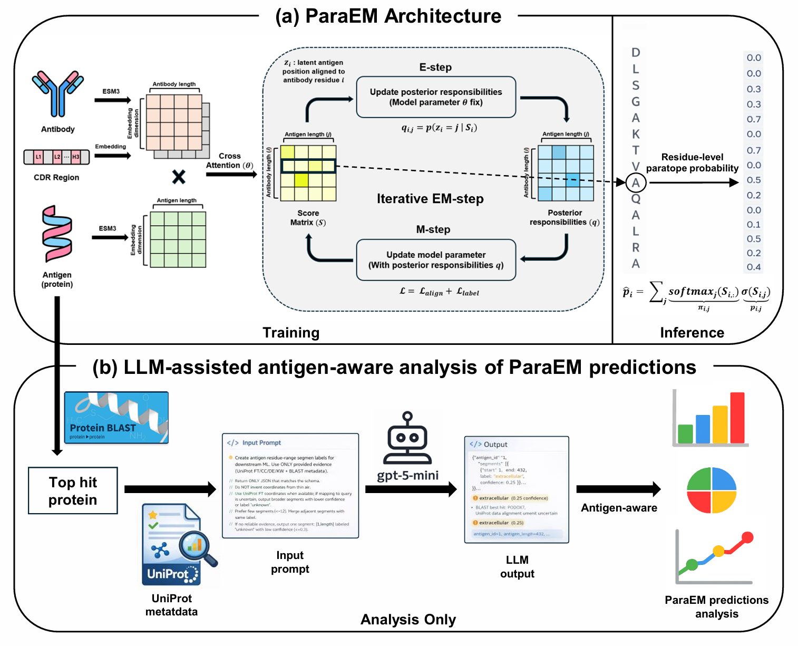

# ParaEM: Sequence-based paratope predictor using Expectation-Maximization with CDR prior
The official code implementation for the paper [ParaEM: Sequence-based paratope predictor using Expectation-Maximization with CDR prior]

## Model Architecture
The overall framework of our work is shown below.


## Dataset
All the data used in the experiments can be found in the data folder. (PECAN / Paragraph_Expanded / MIPE)

## End-to-end pipeline
### Data Process
From IMGT-renumbered PDB file (downloaded from SabDab Database), genereate:
- {pdb}_antibody.fasta
- {pdb}_antigen.fasta
- {pdb}_imgt.txt (0..6 per antibody residue)

**Command**
```
python data_process.py \
  --pdb_name 1abc_imgt.pdb \
  --VH_chain H \
  --VL_chain L \
  --antigen_chain "A;B" \
  --output out/1abc
```

**Output**
```
out/1abc/
  1abc_antibody.fasta
  1abc_antigen.fasta
  1abc_imgt.txt
```

**Note**
If multiple antigen chains are used, always wrap them in quotes:
```
"A;B"
```

### ESM3 embedding generate
Generate per-residue ESM3 embeddings and save them as .pkl file. (torch.Tensor)

**Hugging Face token**
You need a Hugging Face access token to download ESM3 weights.
1. Log in to Hugging Face (web)
2. Go to Settings → Access Tokens
3. Create a new token


**Antibody/Antigen Embedding
```
python esm3_generate.py \
  --hugging_token "hf_xxxxxxxxxxxxxxxxx" \
  --fasta_file out/1abc/1abc_antibody.fasta \
  --output out/1abc/emb
```
