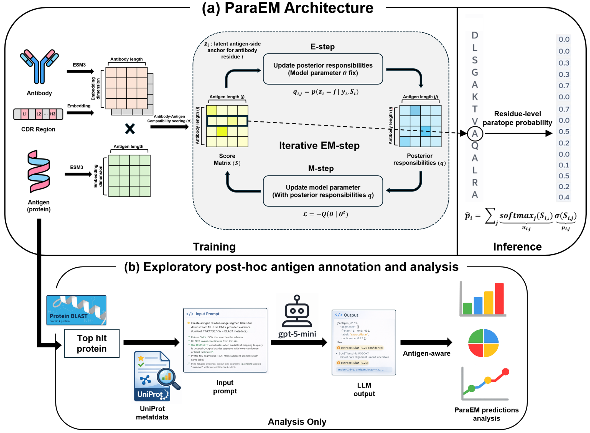

# ParaEM: Sequence-based paratope predictor using Expectation-Maximization with CDR prior
The official code implementation for the paper [ParaEM: Sequence-based paratope predictor using Expectation-Maximization with CDR prior]

## Model Architecture
The overall framework of our work is shown below.


## Dataset
All the data used in the experiments can be found in the data folder. (PECAN / Paragraph_Expanded / MIPE)

## End-to-end pipeline
All the code used in the pipeline can be found in the model folder.
### Data Process
From IMGT-renumbered PDB file (downloaded from SabDab Database), generate:
- {pdb}_antibody.fasta
- {pdb}_antigen.fasta
- {pdb}_imgt.txt (0..6 per antibody residue)

**Command**
```
python data_process.py \
  --pdb_name {pdb}.pdb \
  --VH_chain H \
  --VL_chain L \
  --antigen_chain "A;B" \
  --output output/path/
```

**Output**
```
output/path/
  {pdb}_antibody.fasta
  {pdb}_antigen.fasta
  {pdb}_imgt.txt
```

**Note**

If multiple antigen chains are used, always wrap them in quotes:
```
"A;B"
```


### Generate ESM3 embeddings
Generate per-residue ESM3 embeddings and save them as .pkl file. (torch.Tensor)

**Hugging Face token**

You need a Hugging Face access token to download ESM3 weights.
1. Log in to Hugging Face (web)
2. Go to Settings → Access Tokens
3. Create a new token


**Antibody/Antigen Embedding**
**Command**
```
python esm3_generate.py \
  --hugging_token "hf_xxxxxxxxxxxxxxxxx" \
  --fasta_file {pdb}_antibody.fasta \
  --output output/path/
```

**Output**
```
output/path/
  {pdb}_antibody_esm3.pkl
```


### Model training
Train and validate ParaEM to reproduce the paper's results:

**Command**
```
python train.py \
  --train_antibody path/to/train_ab_embs_esm3.pkl \
  --train_antigen path/to/train_ag_embs_esm3.pkl \
  --train_labels path/to/train_label \
  --train_imgt path/to/train_imgt \
  --valid_antibody path/to/valid_ab_embs_esm3.pkl \
  --valid_antigen path/to/valid_ag_embs_esm3.pkl \
  --valid_labels path/to/valid_label \
  --valid_imgt path/to/valid_imgt \
  --test_antibody path/to/test_ab_embs_esm3.pkl \
  --test_antigen path/to/test_ag_embs_esm3.pkl \
  --test_labels path/to/test_label \
  --test_imgt path/to/test_imgt \
  --em_iters 50 \
  --m_epochs 2 \
  --lr 1e-5 \
  --patience 10 \
  --save_path path/to/output/best_paraem.pt
```

Replace `path/to/...` with the corresponding processed files for PECAN, Paragraph Expanded, or MIPE.
The best checkpoint is selected using validation macro AUC-PR and saved to `--save_path`.


### Model inference
Predict residue-wise paratope probabilities

**Command**
```
python predict.py \
  --ab_esm3 {pdb}_antibody_esm3.pkl \
  --ag_esm3 {pdb}_antigen_esm3.pkl \
  --imgt_txt {pdb}_imgt.txt \
  --model_pt model_weight/{model_name}.pt \
  --output output/path/
```

**Output**
```
output/path/
  pred.tsv
```

**pred.tsv format**
```
idx    prob
0      0.123456
1      0.004321
2      0.876543
...
L-1    0.102938
```
- idx: residue index (0-based)
- prob: predicted paratope probability


---

## Toy example for inference

### Environment

We recommend using conda.

```
conda env create -f environment.yml
conda activate paraem
```

### Data Process

```
python model/data_process.py \
  --pdb_name example/1CIC.pdb \
  --VH_chain A \
  --VL_chain B \
  --antigen_chain "D;C" \
  --output example/output/
```

**Output**

```
example/output/
  1CIC_antibody.fasta
  1CIC_antigen.fasta
  1CIC_imgt.txt
```

### Generate ESM3 embeddings

For antibody sequence:

```
python model/esm3_generate.py \
  --hugging_token "hf_xxxxxxxxxxxxxxxxx" \
  --fasta_file example/output/1CIC_antibody.fasta \
  --output example/output/
```

For antigen sequence:

```
python model/esm3_generate.py \
  --hugging_token "hf_xxxxxxxxxxxxxxxxx" \
  --fasta_file example/output/1CIC_antigen.fasta \
  --output example/output/
```

**Output**
```
example/output/
  1CIC_antibody_esm3.pkl
  1CIC_antigen_esm3.pkl
```

### Inference

```
python model/predict.py \
  --ab_esm3 example/output/1CIC_antibody_esm3.pkl \
  --ag_esm3 example/output/1CIC_antigen_esm3.pkl \
  --imgt_txt example/output/1CIC_imgt.txt \
  --model_pt model/model_weight/pecan_model.pth \
  --output example/output/
```

**Output**
```
example/output/
  pred.tsv
```
